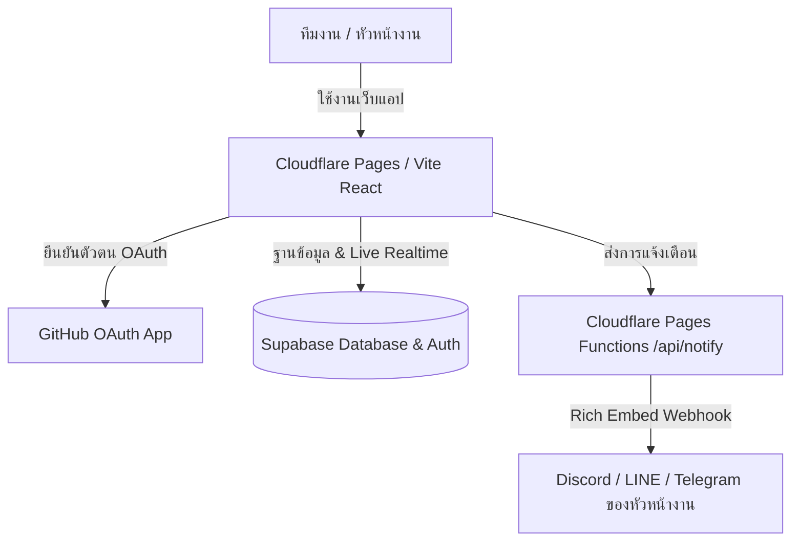

# 🕒 TimeTrack Pro: ระบบลงเวลางานประจำวัน (GitHub + Supabase + Cloudflare)

ระบบลงเวลางาน (Attendance Tracking & Supervisor Alerts) สำหรับทีมงานและหัวหน้างาน รองรับการลงเวลางานประจำวัน (Clock In / Clock Out), ระบุสถานที่ (Office / WFH / On-site), คำนวณสถานะตรงเวลาหรือมาสายอัตโนมัติ และ**ส่งการแจ้งเตือนหาหัวหน้างานทันทีผ่าน Webhook (Discord, LINE, Telegram)**

---

## 🌟 จุดเด่นและฟีเจอร์หลัก (Key Features)

### 1. สำหรับทีมงาน (Employee)
- **บันทึกเวลาเข้างาน (Clock In)**: บันทึกเวลาด้วยคลิกเดียว พร้อมเลือกรูปแบบงาน (🏢 เข้าออฟฟิศ, 🏠 Work From Home, 🚗 ทำงานนอกสถานที่)
- **ระบบจับพิกัดสถานที่อัตโนมัติ (Geolocation)**: ดึงพิกัด GPS หรือที่ตั้งปัจจุบัน
- **บันทึกแผนงานประจำวัน**: กรอกบันทึกสั้นๆ ว่าวันนี้ตั้งเป้าทำอะไร
- **บันทึกเวลาออกงาน (Clock Out)**: พร้อมสรุปงานที่ทำสำเร็จประจำวัน
- **สถิติและประวัติส่วนตัว**: สรุปวันเข้างานตรงเวลา, วันที่มาสาย, และประวัติย้อนหลัง

### 2. สำหรับหัวหน้างาน (Supervisor / Manager)
- **Real-Time Live Dashboard**: ซิงก์ข้อมูลสดผ่าน **Supabase Realtime** โดยไม่ต้องกดรีเฟรชหน้าจอ
- **แจ้งเตือนทันทีเมื่อทีมงานเข้างาน**: ส่ง Webhook เข้า **Discord**, **LINE Notify / Messaging API** หรือ **Telegram** ทันที พร้อมระบุชื่อ, เวลา, สถานะ (ตรงเวลา/สาย), รูปแบบงาน และแผนงาน
- **สรุปภาพรวม KPI ประจำวัน**:
  - จำนวนทีมงานทั้งหมด
  - จำนวนคนที่เข้างานแล้ว
  - จำนวนคนที่ยังไม่ได้ลงเวลา
  - จำนวนคนที่เข้างานสาย
- **ตารางรายชื่อทีมงานแบบละเอียด**: ค้นหาตามชื่อ, แผนก, หรือ GitHub Username และกรองตามสถานะ
- **ส่งออกรายงาน (Export CSV)**: ดาวน์โหลดไฟล์ CSV สำหรับส่งต่อฝ่ายบุคคล (HR/Payroll) รองรับภาษาไทยใน Excel (UTF-8 with BOM)
- **ระบบตั้งค่าเกณฑ์เวลาเข้างาน**: กำหนดเวลาเข้างานมาตรฐาน (เช่น 09:00 น.) และระยะเวลาผ่อนปรน (Grace Period)

---

## 🏗️ สถาปัตยกรรมระบบ (Architecture)



1. **GitHub**:
   - ล็อกอินด้วยบัญชี GitHub ผ่าน Supabase Auth
   - เชื่อมโยงบัญชีและแสดง GitHub Profile อัตโนมัติ
   - CI/CD Deployment ไปยัง Cloudflare Pages อัตโนมัติเมื่อ Push โค้ด
2. **Supabase**:
   - PostgreSQL Database สำหรับจัดเก็บข้อมูลพนักงาน, บันทึกการลงเวลา และการตั้งค่า
   - Row Level Security (RLS) เพื่อความปลอดภัยของข้อมูล
   - Supabase Realtime เพื่ออัปเดตสถานะบนหน้าจอหัวหน้างานแบบเรียลไทม์
3. **Cloudflare**:
   - **Cloudflare Pages**: โฮสต์ Web Application บน Global Edge Network ทั่วโลก
   - **Cloudflare Pages Functions (`/api/notify`)**: ทำหน้าที่เป็น Edge Webhook Relay ส่งข้อความแจ้งเตือนหาหัวหน้างานอย่างปลอดภัยและป้องกันปัญหา CORS

---

## 🚀 เริ่มต้นใช้งานในเครื่อง (Local Development)

### 1. ติดตั้ง Dependencies และรันแอป
```bash
cd attendance-system
bun install
bun run dev
```
> แอปพลิเคชันมี **โหมดจำลอง (Interactive Demo Mode)** ในตัว ทำให้สามารถเปิดทดสอบการลงเวลา, สลับผู้ใช้ระหว่างพนักงานกับหัวหน้างาน และทดสอบระบบได้ทันทีโดยยังไม่ต้องมี API Key!

---

## ⚙️ ขั้นตอนการเชื่อมต่อ Production (GitHub + Supabase + Cloudflare)

### ขั้นตอนที่ 1: ตั้งค่า Supabase Database
1. เข้าไปที่ [supabase.com](https://supabase.com) และสร้างโปรเจกต์ใหม่
2. ไปที่เมนู **SQL Editor > New query**
3. คัดลอกโค้ดทั้งหมดจากไฟล์ `supabase/schema.sql` ในโปรเจกต์นี้ไปวาง แล้วกด **Run**
4. ไปที่ **Project Settings > API** แล้วคัดลอก:
   - `Project URL`
   - `anon / public API Key`
5. นำมากรอกในไฟล์ `.env`:
   ```env
   VITE_SUPABASE_URL=https://your-project.supabase.co
   VITE_SUPABASE_ANON_KEY=your-anon-key
   ```

### ขั้นตอนที่ 2: ตั้งค่า GitHub OAuth ใน Supabase
1. ไปที่ GitHub: **Settings > Developer settings > OAuth Apps > New OAuth App**
2. กรอกข้อมูล:
   - **Application name**: `Attendance System`
   - **Homepage URL**: URL เว็บของคุณบน Cloudflare Pages (หรือ `http://localhost:5173` สำหรับทดสอบ)
   - **Authorization callback URL**: `https://<YOUR-SUPABASE-PROJECT-ID>.supabase.co/auth/v1/callback`
3. กด **Register application** และสร้าง **Client Secret**
4. ใน Supabase Dashboard: ไปที่ **Authentication > Providers > GitHub** เปิดใช้งานและกรอก `Client ID` กับ `Client Secret`

### ขั้นตอนที่ 3: ตั้งค่า Webhook แจ้งเตือนหัวหน้างาน
1. เข้าสู่ระบบในเว็บแอป แล้วกดปุ่ม **"ตั้งค่า Webhook"** ที่แถบเมนูด้านบน
2. เลือกช่องทางที่ต้องการ:
   - **Discord Webhook**: ใน Discord Server คลิกขวาที่ห้องแชทของหัวหน้างาน > `Edit Channel` > `Integrations` > `Webhooks` > `New Webhook` แล้วคัดลอก URL มาวาง
   - **Telegram**: ระบุ URL ของ Telegram Bot
   - **LINE**: ระบุ Webhook URL
3. กดปุ่ม **"ทดสอบส่งข้อความแจ้งเตือน"** เพื่อทดสอบการแจ้งเตือนทันที!

### ขั้นตอนที่ 4: Deploy ขึ้น Cloudflare Pages
#### วิธีที่ 1: เชื่อมต่อผ่าน GitHub (แนะนำ)
1. Push โค้ดนี้ขึ้น GitHub Repository ของคุณ
2. เข้าสู่แดชบอร์ด [Cloudflare Dashboard](https://dash.cloudflare.com/) > **Workers & Pages > Create application > Pages > Connect to Git**
3. เลือก Repository แล้วตั้งค่าการ Build:
   - **Build command**: `bun run build` หรือ `npm run build`
   - **Build output directory**: `dist`
4. เพิ่ม Environment Variables:
   - `VITE_SUPABASE_URL`
   - `VITE_SUPABASE_ANON_KEY`
5. กด **Save and Deploy** เสร็จสิ้น!

#### วิธีที่ 2: Deploy ด้วย Wrangler CLI
```bash
bun run build
bunx wrangler pages deploy dist --project-name attendance-system
```

---

## 📁 โครงสร้างโปรเจกต์ (Project Structure)

```
attendance-system/
├── .github/
│   └── workflows/
│       └── deploy.yml            # CI/CD Deploy ไปยัง Cloudflare Pages
├── functions/
│   └── api/
│       └── notify.ts             # Cloudflare Pages Function (Webhook Relay)
├── src/
│   ├── components/
│   │   ├── icons/
│   │   │   └── GithubIcon.tsx    # SVG Icon
│   │   ├── AuthModal.tsx         # หน้าต่างเข้าสู่ระบบ (GitHub / Email)
│   │   ├── EmployeeDashboard.tsx # หน้าจอลงเวลาสำหรับทีมงาน
│   │   ├── Header.tsx            # Header, นาฬิกาดิจิทัล, สลับผู้ใช้
│   │   ├── SettingsModal.tsx     # ตั้งค่าเกณฑ์เวลาและ Webhook
│   │   ├── SetupGuideModal.tsx   # คู่มือการติดตั้งทีละขั้นตอน
│   │   └── SupervisorDashboard.tsx # แดชบอร์ดสรุปผลและรายงานสดของหัวหน้างาน
│   ├── lib/
│   │   ├── notifications.ts      # ฟังก์ชันส่ง Webhook ไปยังช่องทางต่างๆ
│   │   └── supabase.ts           # Supabase Client & การตรวจจับสถานะ
│   ├── services/
│   │   └── attendanceService.ts  # Service layer รองรับทั้ง Live DB และ Mock Demo
│   ├── types/
│   │   └── attendance.ts         # TypeScript Interfaces
│   ├── App.tsx                   # Main App Component
│   ├── index.css                 # Tailwind CSS v4 Styles
│   └── main.tsx
├── supabase/
│   └── schema.sql                # SQL สร้างตาราง, RLS, และ Realtime
├── wrangler.toml                 # ตั้งค่า Cloudflare Pages
├── package.json
└── vite.config.ts
```

---

## 🔒 ความปลอดภัย (Security & RLS)
- ข้อมูลใน Supabase ถูกจำกัดการเข้าถึงด้วย **Row Level Security (RLS)**
- ทีมงานสามารถดูและแก้ไขเฉพาะบันทึกเวลาของตนเองเท่านั้น
- หัวหน้างานและผู้ดูแลระบบ (Role `manager` และ `admin`) สามารถดูรายงานภาพรวมของทีมและแก้ไขการตั้งค่าระบบได้
- Webhook Relay ฝั่ง Cloudflare ป้องกันไม่ให้ Token ภายในรั่วไหลสู่หน้าบ้าน
